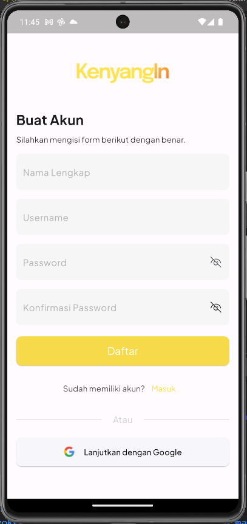

# Better App

Better app adalah aplikasi untuk baca buku, user dapat login dan register  lalu juga user dapat melakukan tambah buku, edit buku, baca buku yang telah dimasukkan oleh user.

## Installation

Clone project ini

```bash
https://github.com/Azis202017/Better-App.git
```

Mendapatkan dependency

```bash
flutter pub get
```

Menjalankan project

```bash
flutter run
```

Akun demo

```bash
Username : rizal
Password : sayarijal
```

## Screenshots





